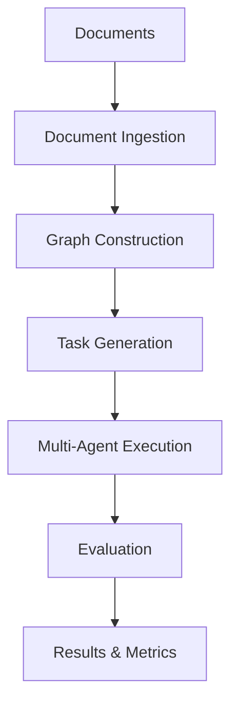

<div align="center">
  
</div>

# Graph2Eval: Automatic Multimodal Task Generation for Agents via Knowledge Graphs
[](https://www.python.org/downloads/)
[](https://opensource.org/licenses/MIT)

## 🎯 Overview

Bench is a comprehensive **graph-based LLM benchmarking framework** designed for evaluating and improving Large Language Model (LLM) performance across multiple dimensions. This framework combines **Graph-based Retrieval-Augmented Generation** with **automated task generation** and **multi-agent evaluation** to create a robust benchmarking system.

The framework now includes **Web Agent capabilities** for web-based multi-hop task generation and evaluation, enabling comprehensive testing of LLM performance on real-world web interaction scenarios through the integrated web collection and task generation system in the main framework.

---

### 🔍 Key Features

- **📚 Document Processing**: Automatic document ingestion, cleaning, and chunking
- **🕸️ Graph Construction**: Build knowledge graphs from documents using GraphRAG
- **🎯 Task Generation**: Automatically generate diverse tasks from knowledge graphs
- **🤖 Multi-Agent System**: Five specialized agents (Planner, Retriever, Reasoner, Verifier, Summarizer)
- **🌐 Web Agent**: Web-based multi-hop task generation and evaluation
- **📊 Comprehensive Metrics**: Task success rate, safety compliance, attribution accuracy
- **🔧 Configurable**: Flexible configuration for different use cases

## 🏗️ Agent Architecture

The Graph2Eval system implements multiple agent architectures with flexible RAG capabilities:

### 1. Single Agent Architecture
- **No-RAG Mode**: Direct reasoning without knowledge graph retrieval
- **RAG Mode**: Enhanced with Retrieval-Augmented Generation capabilities

### 2. Multi-Agent System
A collaborative framework with five specialized agents:

```
┌─────────────────────────────────────────────────────────────┐
│                    Multi-Agent System                        │
├─────────────────────────────────────────────────────────────┤
│  Planner Agent  │  Retriever Agent  │  Reasoner Agent       │
│  (Planning)     │  (Information)    │  (Analysis)           │
├─────────────────────────────────────────────────────────────┤
│  Verifier Agent │  Summarizer Agent │                       │
│  (Validation)   │  (Synthesis)      │                       │
└─────────────────────────────────────────────────────────────┘
```

**Agent Roles:**
- **Planner**: Breaks down complex tasks into manageable steps
- **Retriever**: Searches and retrieves relevant information from knowledge graphs
- **Reasoner**: Performs logical analysis and reasoning
- **Verifier**: Validates answers and checks for consistency
- **Summarizer**: Synthesizes information into final responses

### 3. Web Agent Architecture
Specialized agents for web-based tasks:
- **Agent S 2.5**: Web agent with built-in reflection mechanism for self-improvement ([project](https://github.com/simular-ai/Agent-S))
- **SoM Agent**: Web agent that performs Set-of-marks annotation on input images for precise interaction

### Configuration Options
- **Agent Mode**: `single`, `multi`, `web`
- **Agent Type**: `no_rag`, `rag`, `agent_s`, `som_agent`
- **RAG Integration**: Optional knowledge graph retrieval for all agent types

### Core Workflow



## 📖 Citation

We would be grateful if you could cite our paper if you find this work helpful for your research:

```bibtex
@misc{chen2025graph2evalautomaticmultimodaltask,
      title={Graph2Eval: Automatic Multimodal Task Generation for Agents via Knowledge Graphs}, 
      author={Yurun Chen and Xavier Hu and Yuhan Liu and Ziqi Wang and Zeyi Liao and Lin Chen and Feng Wei and Yuxi Qian and Bo Zheng and Keting Yin and Shengyu Zhang},
      year={2025},
      eprint={2510.00507},
      archivePrefix={arXiv},
      primaryClass={cs.CL},
      url={https://arxiv.org/abs/2510.00507}, 
}
```

If you find this project useful, we would also appreciate a ⭐ star on GitHub!


## 🚀 Quick Start

### 1. Environment Setup

```bash
# Clone the repository
git clone git@github.com:YurunChen/Graph2Eval.git
cd Graph2Eval

# Create conda environment
chmod +x setup_environment.sh
./setup_environment.sh 

```
This creates a conda environment named `graphrag-bench`. Activate it:

```bash
conda activate graphrag-bench
```

### 2. Configuration Setup

#### API Keys Configuration

**Option 1: Using .env file (Recommended)**

Create a `.env` file in the root directory:

```bash
# Copy the example file
cp .env.example .env

# Edit .env with your actual API keys
nano .env
```

Example `.env` file:
```bash
# OpenAI API Configuration
OPENAI_API_KEY=your-openai-api-key-here
OPENAI_BASE_URL=https://api.openai.com/v1/
OPENAI_ORGANIZATION=your-openai-organization-id

# Anthropic API Configuration
ANTHROPIC_API_KEY=your-anthropic-api-key-here
ANTHROPIC_BASE_URL=https://api.anthropic.com/v1/

# Hugging Face API Configuration
HUGGINGFACE_API_KEY=your-huggingface-api-key-here
HUGGINGFACE_CACHE_DIR=models/huggingface
```

**Option 2: Configure directly in `configs/main_config.yaml`:**

```yaml
# configs/main_config.yaml
apis:
  # Anthropic API Configuration
  anthropic:
    api_key: your-anthropic-api-key-here
    base_url: https://api.anthropic.com/v1/
  
  # Hugging Face API Configuration
  huggingface:
    api_key: your-huggingface-api-key-here
    cache_dir: models/huggingface
  
  # OpenAI API Configuration
  openai:
    api_key: your-openai-api-key-here
    base_url: https://api.openai.com/v1/
    organization: your-openai-organization-id
```

#### Multi-Agent Configuration

Configure individual agent models in `configs/agent_config.yaml`:

```yaml
# Enable multi-agent system
enable_multi_agent: true

# Multi-agent configuration
multi_agent:
  # Individual LLM models for each agent
  planner_model: gpt-4o-mini
  retriever_model: gpt-4o-mini
  reasoner_model: gpt-4o-mini
  verifier_model: gpt-4o-mini
  summarizer_model: gpt-4o-mini
  
  # System configuration
  enable_parallel_execution: false
  enable_agent_communication: true
  max_iterations: 3
  confidence_threshold: 0.7
  verbose: true
```

### 3. Run Your First Benchmark

The benchmark system supports four main modes: `collect`, `graph`, `generate`, and `evaluate`. Here's how to use each mode:

#### Mode 1: Collect Data from Documents/URLs

```bash
# Collect data from documents
python benchmark_runner.py --mode collect \
    --documents data/documents/sample.pdf data/documents/another.pdf

# Collect data from web URLs
python benchmark_runner.py --mode collect \
    --urls https://example.com https://httpbin.org/html

# Custom output folder name using -n parameter
python benchmark_runner.py --mode collect \
    --documents data/documents/sample.pdf \
    -n my_custom_collection
```

#### Mode 2: Build Knowledge Graph

```bash
# Build graph from collected data
python benchmark_runner.py --mode graph \
    --collection data/run_files/collections/ \
    --output-dir data/run_files/graph/

# Custom output folder name using -n parameter
python benchmark_runner.py --mode graph \
    --collection data/run_files/collections/ \
    --output-dir data/run_files/graph/ \
    -n my_custom_graph
```

#### Mode 3: Generate Tasks from Graph

```bash
# Generate tasks from knowledge graph
python benchmark_runner.py --mode generate \
    --graph data/run_files/graph/ \
    --output-dir data/run_files/datasets/

# Custom output folder name using -n parameter
python benchmark_runner.py --mode generate \
    --graph data/run_files/graph/ \
    --output-dir data/run_files/datasets/ \
    -n my_custom_tasks
```

#### Mode 4: Evaluate Agent Performance

```bash
# Evaluate on a single dataset file
python benchmark_runner.py --mode evaluate \
    --file data/run_files/datasets/tasks.jsonl

# Batch evaluate on multiple datasets
python benchmark_runner.py --mode evaluate \
    --datasets-folder data/run_files/datasets/ \
    --dataset-type all  # normal or all

# Resume evaluation from existing results
python benchmark_runner.py --mode evaluate \
    --resume output/evaluate/run_20241201_120000/

# Only evaluate existing results (skip execution)
python benchmark_runner.py --mode evaluate \
    --file data/run_files/datasets/tasks.jsonl \
    --evaluate-only

# Custom output folder name using -n parameter
python benchmark_runner.py --mode evaluate \
    --file data/run_files/datasets/tasks.jsonl \
    -n my_custom_evaluation
```

#### Complete Workflow Example

```bash
# Step 1: Collect data from documents
python benchmark_runner.py --mode collect \
    --documents data/documents/sample.pdf

# Step 2: Build knowledge graph
python benchmark_runner.py --mode graph \
    --collection data/run_files/collections/ \
    --output-dir data/run_files/graph/

# Step 3: Generate tasks
python benchmark_runner.py --mode generate \
    --graph data/run_files/graph/ \
    --output-dir data/run_files/datasets/

# Step 4: Evaluate agents
python benchmark_runner.py --mode evaluate \
    --datasets-folder data/run_files/datasets/ \
    --dataset-type all
```

## 📁 Project Structure

```
Graph2Eval/
├── 📋 benchmark_runner.py          # Main execution script
├── ⚙️ config_manager.py            # Configuration management
├── 📚 ingestion/                   # Document processing and web collection
│   ├── parsers.py                  # Document parsers
│   ├── cleaners.py                 # Text cleaning utilities
│   ├── chunkers.py                 # Text chunking strategies
│   ├── web_collector.py            # Web data collection
│   └── tool.py                     # Ingestion tools
├── 🕸️ graph_rag/                  # Graph construction and storage
│   ├── graph_builder.py            # Knowledge graph builder
│   ├── embeddings.py               # Vector embeddings
│   ├── storage.py                  # Graph storage backends
│   ├── node_types.py               # Node type definitions
│   └── edge_types.py               # Edge type definitions
├── 🎯 task_craft/                 # Task generation and optimization
│   ├── task_generator.py           # Main task generator
│   ├── task_templates.py           # Task templates
│   ├── subgraph_sampler.py         # Subgraph sampling
│   └── task_coverage_optimizer.py  # Task optimization
├── 🤖 agent_framework/             # Agent execution framework
│   ├── agent.py                    # Base agent classes
│   ├── multi_agent_system.py       # Multi-agent coordination
│   ├── executors.py                # LLM execution
│   ├── evaluators.py               # Task evaluation
│   ├── retrievers.py               # Knowledge retrieval
│   └── attributors.py              # Attribution analysis
├── 🗂️ configs/                    # Configuration files
│   ├── main_config.yaml            # Main configuration
│   ├── agent_config.yaml           # Agent settings
│   ├── task_craft_config.yaml      # Task generation settings
│   ├── graph_rag_config.yaml       # Graph construction settings
│   ├── datasets_config.yaml        # Dataset configuration
│   ├── ingestion_config.yaml       # Data ingestion settings
├── 📁 data/                       # Working data and datasets
│   ├── document/                   # Source documents
│   ├── datasets/                   # Generated datasets
│   ├── policy/                     # Safety policy files
│   └── res/                        # Results and outputs
├── 📊 output/                     # Results and evaluation outputs
│   ├── collect/                    # Data collection results
│   ├── graph/                      # Graph construction results
│   ├── generate/                   # Task generation results
│   └── evaluate/                   # Evaluation results
└── 🧪 logs/                       # Execution logs
```

## 🛠️ Configuration

### Core Configuration Files

| File | Purpose |
|------|---------|
| `main_config.yaml` | Main configuration file for benchmark |
| `agent_config.yaml` | Agent execution and multi-agent settings |
| `task_craft_config.yaml` | Task generation parameters |
| `graph_rag_config.yaml` | Graph construction and storage settings |
| `datasets_config.yaml` | Dataset creation and quality control |
| `ingestion_config.yaml` | Document processing and web collection settings |

### Key Configuration Parameters

```yaml
# agent_config.yaml
agent_mode: single  # single, multi, web
agent_type: rag     # no_rag, rag, agent_s, som_agent

# Single agent configuration
single_agent:
  model:
    model_name: gpt-4o-mini
    max_tokens: 4000
    temperature: 0.1
    response_format: structured

# Multi-agent configuration
multi_agent:
  planner_model: gpt-4o-mini
  retriever_model: gpt-4o-mini
  reasoner_model: gpt-4o-mini
  verifier_model: gpt-4o-mini
  summarizer_model: gpt-4o-mini

# task_craft_config.yaml
generation:
  max_total_tasks: 500
  require_gold_answer: true
  require_citations: true
  llm_model_name: "gpt-4o-mini"
  llm_temperature: 0.1
  llm_max_tokens: 4000
  use_llm_quality_check: true
  llm_quality_threshold: 0.7

# datasets_config.yaml
dataset_creation:
  save_format: "jsonl"
  max_total_samples: 5
  min_samples_per_type: 1
  min_quality_score: 0.5
  min_success_rate: 0.3

# graph_rag_config.yaml
graph_builder:
  create_chunk_nodes: true
  create_entity_nodes: true
  semantic_similarity_threshold: 0.7
  chunk_size: 500
  chunk_overlap: 50

storage:
  backend: "json"
  file_path: "data/run_files/graph/knowledge_graph.json"
```

## 🎯 Usage Examples

### Command Line Usage

#### Single Document Processing
```bash
# Process a single PDF document
python benchmark_runner.py --mode collect --documents data/documents/research_paper.pdf
python benchmark_runner.py --mode graph --collection data/run_files/collections/
python benchmark_runner.py --mode generate --graph data/run_files/graph/
python benchmark_runner.py --mode evaluate --file data/run_files/datasets/tasks.jsonl
```

#### Batch Processing Multiple Documents
```bash
# Process multiple documents
python benchmark_runner.py --mode collect \
    --documents data/documents/*.pdf data/documents/*.txt

# Batch evaluate multiple datasets
python benchmark_runner.py --mode evaluate \
    --datasets-folder data/run_files/datasets/ \
    --dataset-type all
```

#### Web-based Task Generation
```bash
# Collect data from web URLs
python benchmark_runner.py --mode collect \
    --urls https://example.com https://httpbin.org/html

# Continue with normal workflow
python benchmark_runner.py --mode graph --collection data/run_files/collections/
python benchmark_runner.py --mode generate --graph data/run_files/graph/
python benchmark_runner.py --mode evaluate --datasets-folder data/run_files/datasets/
```

#### Resume and Debug Options
```bash
# Resume interrupted evaluation
python benchmark_runner.py --mode evaluate \
    --resume output/evaluate/run_20241201_120000/

# Debug mode with verbose logging
python benchmark_runner.py --mode evaluate \
    --file data/run_files/datasets/tasks.jsonl \
    --debug

# Only evaluate existing results (skip execution)
python benchmark_runner.py --mode evaluate \
    --file data/run_files/datasets/tasks.jsonl \
    --evaluate-only
```

### Configuration Examples

#### Single Agent with RAG
```yaml
# agent_config.yaml
agent_mode: single
agent_type: rag
single_agent:
  model:
    model_name: gpt-4o-mini
    max_tokens: 4000
    temperature: 0.1
    response_format: structured
```

#### Multi-Agent System
```yaml
# agent_config.yaml
agent_mode: multi
agent_type: rag
multi_agent:
  planner_model: gpt-4o-mini
  retriever_model: gpt-4o-mini
  reasoner_model: gpt-4o-mini
  verifier_model: gpt-4o-mini
  summarizer_model: gpt-4o-mini
```

#### Web Agent Configuration
```yaml
# agent_config.yaml
agent_mode: web
agent_type: agent_s  # or som_agent
web_agent:
  model:
    model_name: gpt-4o-mini
    max_tokens: 4000
    temperature: 0.1
```

## 📊 Output Structure

The system creates organized output directories for each mode:

### Collect Mode Output
```
output/collect/run_collect_1757165919/
├── documents/                          # Processed document images
│   ├── page_1.png
│   ├── page_2.png
│   └── ...
├── results/                            # Collection results
│   └── collection_results.json
├── web_info/                           # Web collection data
│   ├── page_info.json
│   └── screenshots/
└── datasets/                           # Extracted datasets
    └── documents.jsonl
```

### Graph Mode Output
```
output/graph/run_graph_1757165919/
├── graph/
│   └── knowledge_graph.json           # Built knowledge graph
├── vectors/                            # Vector embeddings
│   ├── vectors_faiss.faiss
│   ├── vectors_faiss.metadata
│   └── vectors_nodes.pkl
└── results/
    └── graph_build_results.json
```

### Generate Mode Output
```
output/generate/run_gen_1757165919/
├── datasets/                           # Generated task datasets
│   ├── all_tasks.jsonl
│   ├── normal_tasks.jsonl
│   └── safety_tasks.jsonl
├── subgraphs/                          # Subgraph samples
│   ├── basic_extraction_subgraphs.json
│   └── table_qa_subgraphs.json
└── results/
    └── generation_results.json
```

### Evaluate Mode Output
```
output/evaluate/test_text_single_agent_rag/
├── results/
│   └── individual_results/             # Individual task results
│       ├── task_22f7cb5c_20251002_134635.json
│       ├── task_3bb12f3f_20251002_140156.json
│       └── ...
├── evaluation/                         # Evaluation metrics
└── file_images/                        # Task-related images
```

### Data Flow Structure

```
data/run_files/
├── collections/                        # Collected document data
│   ├── documents.jsonl
│   └── web_data.jsonl
├── graph/                              # Knowledge graph data
│   ├── knowledge_graph.json
│   └── vectors/
│       ├── vectors_faiss.faiss
│       └── vectors_faiss.metadata
└── datasets/                           # Generated task datasets
    ├── all_tasks.jsonl
    ├── normal_tasks.jsonl
    └── safety_tasks.jsonl
```

## 🔍 Advanced Features

### Command Line Options

```bash
# Custom run name
python benchmark_runner.py --mode evaluate \
    --file data/run_files/datasets/tasks.jsonl \
    --run-name "experiment_v1"

# Dataset type filtering
python benchmark_runner.py --mode evaluate \
    --datasets-folder data/run_files/datasets/ \
    --dataset-type normal  # Only normal tasks

# Resume interrupted evaluation
python benchmark_runner.py --mode evaluate \
    --resume output/evaluate/run_20241201_120000/

# Debug mode with verbose logging
python benchmark_runner.py --mode evaluate \
    --file data/run_files/datasets/tasks.jsonl \
    --debug
```

### Multi-Modal Support

- **Document Processing**: PDF, text, and web content ingestion
- **Image Analysis**: Screenshot and document image processing
- **Web Interaction**: Automated web browsing and form filling
- **Graph Construction**: Knowledge graph building from multiple sources

### Task Generation Features

- **Multi-hop Reasoning**: Complex tasks requiring multiple reasoning steps
- **Quality Control**: LLM-based task quality assessment
- **Coverage Optimization**: Intelligent task selection for comprehensive evaluation

### Configuration Flexibility

The system supports flexible configuration through YAML files:

- **Agent Models**: Configure different models for different agents
- **Task Generation**: Control task complexity and diversity
- **Graph Construction**: Customize knowledge graph building parameters
- **Evaluation Metrics**: Define custom evaluation criteria

## 🤝 Contact

For questions, issues, or contributions:

📧 Email: [yurunchen.research@gmail.com](mailto:yurunchen.research@gmail.com)
🐛 Issues: [GitHub Issues](https://github.com/YurunChen/Graph2Eval/issues)


## 📄 License

This project is licensed under the MIT License - see the [LICENSE](LICENSE) file for details.


---

**⭐ Star this repository if you find it helpful!**
