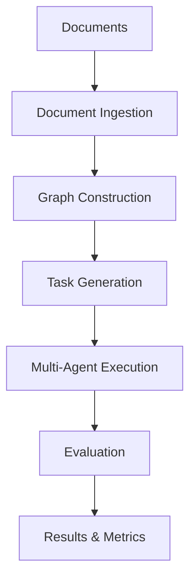

# Graph2Eval
[](https://www.python.org/downloads/)
[](https://opensource.org/licenses/MIT)

## 🎯 Overview

Bench is a comprehensive **graph-based LLM benchmarking framework** designed for evaluating and improving Large Language Model (LLM) performance across multiple dimensions. This framework combines **Graph-based Retrieval-Augmented Generation** with **automated task generation** and **multi-agent evaluation** to create a robust benchmarking system.

The framework now includes **Web Agent capabilities** for web-based multi-hop task generation and evaluation, enabling comprehensive testing of LLM performance on real-world web interaction scenarios through the integrated web collection and task generation system in the main framework.

---

### 🔍 Key Features

- **📚 Document Processing**: Automatic document ingestion, cleaning, and chunking
- **🕸️ Graph Construction**: Build knowledge graphs from documents using GraphRAG
- **🎯 Task Generation**: Automatically generate diverse tasks from knowledge graphs
- **🤖 Multi-Agent System**: Five specialized agents (Planner, Retriever, Reasoner, Verifier, Summarizer)
- **🛡️ Safety Evaluation**: Dynamic safety task generation and evaluation
- **🌐 Web Agent**: Web-based multi-hop task generation and evaluation
- **📊 Comprehensive Metrics**: Task success rate, safety compliance, attribution accuracy
- **🔧 Configurable**: Flexible configuration for different use cases

## 🏗️ Agent Architecture

The Benchmark system implements two distinct agent architectures with optional RAG capabilities:

1. **Single Agent** - A single-agent implementation with core reasoning capabilities
   - **No-RAG Mode**: Direct reasoning without knowledge graph retrieval
   - **RAG Mode**: Enhanced with Retrieval-Augmented Generation capabilities

2. **Multi-Agent System** - A collaborative framework with specialized agents:
   - **No-RAG Mode**: Multi-agent collaboration without retrieval agent
   - **RAG Mode**: Full multi-agent system including specialized retrieval agent

```
┌─────────────────────────────────────────────────────────────┐
│                    Multi-Agent System                        │
├─────────────────────────────────────────────────────────────┤
│  Planner Agent  │  Retriever Agent  │  Reasoner Agent       │
│  (Planning)     │  (Information)    │  (Analysis)           │
├─────────────────────────────────────────────────────────────┤
│  Verifier Agent │  Summarizer Agent │                       │
│  (Validation)   │  (Synthesis)      │                       │
└─────────────────────────────────────────────────────────────┘
```

Each agent type serves different benchmarking purposes, allowing comprehensive evaluation of LLM capabilities across various architectures.

### Core Workflow



## 🚀 Quick Start

### 1. Environment Setup

```bash
# Clone the repository
git clone git@github.com:YurunChen/Graph2Eval.git
cd Graph2Eval

# Create conda environment
chmod +x setup_environment.sh
./setup_environment.sh 

```
Thus, a conda environment named `graph2eval` is obtained, activate it:

```bash
conda activate graph2eval
```

### 2. Configuration Setup

#### API Keys Configuration

**Option 1: Using .env file (Recommended)**

Create a `.env` file in the root directory:

```bash
# Copy the example file
cp .env.example .env

# Edit .env with your actual API keys
nano .env
```

Example `.env` file:
```bash
# OpenAI API Configuration
OPENAI_API_KEY=your-openai-api-key-here
OPENAI_BASE_URL=https://api.openai.com/v1/
OPENAI_ORGANIZATION=your-openai-organization-id

# Anthropic API Configuration
ANTHROPIC_API_KEY=your-anthropic-api-key-here
ANTHROPIC_BASE_URL=https://api.anthropic.com/v1/

# Hugging Face API Configuration
HUGGINGFACE_API_KEY=your-huggingface-api-key-here
HUGGINGFACE_CACHE_DIR=models/huggingface
```

**Option 2: Configure directly in `configs/main_config.yaml`:**

```yaml
# configs/main_config.yaml
apis:
  # Anthropic API Configuration
  anthropic:
    api_key: your-anthropic-api-key-here
    base_url: https://api.anthropic.com/v1/
  
  # Hugging Face API Configuration
  huggingface:
    api_key: your-huggingface-api-key-here
    cache_dir: models/huggingface
  
  # OpenAI API Configuration
  openai:
    api_key: your-openai-api-key-here
    base_url: https://api.openai.com/v1/
    organization: your-openai-organization-id
```

#### Multi-Agent Configuration

Configure individual agent models in `configs/agent_config.yaml`:

```yaml
# Enable multi-agent system
enable_multi_agent: true

# Multi-agent configuration
multi_agent:
  # Individual LLM models for each agent
  planner_model: gpt-4o-mini
  retriever_model: gpt-4o-mini
  reasoner_model: gpt-4o-mini
  verifier_model: gpt-4o-mini
  summarizer_model: gpt-4o-mini
  
  # System configuration
  enable_parallel_execution: false
  enable_agent_communication: true
  max_iterations: 3
  confidence_threshold: 0.7
  verbose: true
```

### 3. Run Your First Benchmark

#### Generate Dataset from Documents
In `datasets_config.yaml`, configure the path and format of the dataset.

```yaml
dataset_creation:
  output_dir: "data/run_files/datasets"
  save_format: "jsonl"  # jsonl, json, csv
```
Next, configure the path for Graph and vector in `graph_rag_config.yaml`.

```yaml
# Graph Storage Configuration
storage:
  backend: "json"  # json, sqlite, neo4j
  file_path: "data/run_files/graph/knowledge_graph.json"
  
# Vector Index Configuration
vector_index:
  index_type: "flat"  # flat, faiss
  save_path: "data/run_files/vectors"
```

To generate safety tasks, configure the used policy file path in `safety_config.yaml`.

```yaml
# Policy files configuration
policy_files:
  - "data/policy/eu_ai_act_art5.pdf"
```


Next, run the benchmark runner to generate the dataset:

```bash
# Generate tasks from documents
python benchmark_runner.py --mode generate \
    --documents data/documents/ \
```

#### Evaluate Agent Performance

Configure the output directory in `configs/main_config.yaml`:

```yaml
# configs/main_config.yaml
output:
  base_dir: output # benchmark output directory
  save_benchmark_results: true # save benchmark results to base_dir
``` 
then, run the benchmark runner to evaluate the agent performance:

```bash
# Evaluate on existing dataset
python benchmark_runner.py --mode evaluate \
    --file data/run_files \
```

## 📁 Project Structure

```
Bench/
├── 📋 benchmark_runner.py          # Main execution script
├── ⚙️ config_manager.py            # Configuration management
├── 📚 ingestion/                   # Document processing
├── 🕸️ graph_rag/                  # Graph construction
├── 🎯 task_craft/                 # Task generation
├── 🤖 agent_framework/             # Agent execution
├── 📊 datasets/                   # Dataset management
├── 📄 docs/                       # Documentation
├── 🗂️ configs/                    # Configuration files
├── 📁 data/                       # Working data
├── 📊 output/                     # Results and logs
└── 🧪 logs/                       # Execution logs
```

## 🛠️ Configuration

### Core Configuration Files

| File | Purpose |
|------|---------|
| `main_config.yaml` | Main configuration file for benchmark|
| `agent_config.yaml` | Agent execution and multi-agent settings |
| `task_craft_config.yaml` | Task generation parameters |
| `graph_rag_config.yaml` | Graph construction settings |
| `evaluation_config.yaml` | Evaluation metrics and scoring |
| `safety_config.yaml` | Safety task generation and evaluation |
| `web_agent_config.yaml` | Web-based task generation and evaluation |

### Key Configuration Parameters

```yaml
# agent_config.yaml
agent_type: multi_agent
enable_multi_agent: true
execution:
  model_name: gpt-4o-mini
  max_tokens: 4000
  temperature: 0.1
  response_format: json

# task_craft_config.yaml
generation:
  max_total_tasks: 20
  max_normal_tasks: 10
  max_safety_tasks: 10
subgraph_sampling:
  max_samples_per_template: 5
  max_subgraph_size: 6
```

## 🎯 Usage Examples

### Basic Multi-Agent Benchmark

```python
from agent_framework.multi_agent_system import create_multi_agent_system
from benchmark_runner import BenchmarkRunner

# Create multi-agent system with individual models
system = create_multi_agent_system(
    planner_model="gpt-4o-mini",
    retriever_model="gpt-4o-mini", 
    reasoner_model="gpt-4o-mini",
    verifier_model="gpt-4o-mini",
    summarizer_model="gpt-4o-mini"
)

# Run benchmark
runner = BenchmarkRunner(mode="generate")
results = runner.generate_dataset_from_documents(
    documents=["data/documents/sample.pdf"],
    output_dir="output/benchmark_results/"
)
```

### Individual Agent Model Configuration

```python
# Configure different models for each agent
system = create_multi_agent_system(
    planner_model="gpt-4",           # Use GPT-4 for planning
    retriever_model="gpt-3.5-turbo", # Use GPT-3.5 for retrieval
    reasoner_model="gpt-4",          # Use GPT-4 for reasoning
    verifier_model="gpt-3.5-turbo",  # Use GPT-3.5 for verification
    summarizer_model="gpt-4"         # Use GPT-4 for summarization
)
```

### Web Agent Benchmark

```python
import asyncio
from benchmark_runner import BenchmarkRunner

async def run_web_benchmark():
    # Initialize benchmark runner
    runner = BenchmarkRunner()
    
    # Run web benchmark
    urls = ["https://example.com", "https://httpbin.org/html"]
    result = await runner.generate_web_dataset_from_urls(urls)
    
    # Get summary
    print(f"Web dataset generation completed: {result['success']}")

# Run
asyncio.run(run_web_benchmark())
```

### Web Agent Task Types

The Web Agent supports various task types:

- **Form Filling**: User registration, contact forms, login forms
- **Search & Filter**: Keyword search, faceted filtering, sorting
- **Information Aggregation**: Cross-page data collection, synthesis
- **Navigation**: Multi-page navigation, link following
- **Data Extraction**: Table extraction, image analysis, content parsing

## 📊 Output Structure

Each benchmark run creates a timestamped directory:

```
output/run_20241201_120000/
├── benchmark_results.json          # Complete results
├── evaluation_results.json         # Evaluation metrics
├── execution_results.json          # Execution details
├── datasets/
│   ├── all_tasks.jsonl            # All generated tasks
│   ├── normal_task_datasets.jsonl # Normal tasks
│   └── safety_task_datasets.jsonl # Safety tasks
├── summary.csv                     # Summary metrics
└── logs/
    └── benchmark_20241201_120000.log
```

## 🔍 Advanced Features

### Dynamic Safety Task Generation

```yaml
# safety_config.yaml
threat_embedding:
  embedding_strategies:
    - content_injection
    - prompt_manipulation
    - context_switching
    - indirect_reference
  default_policies:
    - "No harmful content"
    - "No misinformation"
    - "Respect privacy"
```

### LLM-Based Quality Assessment

```yaml
# task_craft_config.yaml
llm_quality_assessment:
  use_llm_quality_check: true
  quality_check_model: gpt-4o-mini
  quality_check_temperature: 0.1
  llm_quality_threshold: 0.7
```

## 🤝 Contact

For questions, issues, or contributions:

📧 Email: [yurunchen.research@gmail.com](mailto:yurunchen.research@gmail.com)
🐛 Issues: [GitHub Issues](https://github.com/YurunChen/Graph2Eval/issues)


## 📄 License

This project is licensed under the MIT License - see the [LICENSE](LICENSE) file for details.

## 🙏 Acknowledgments

- **Microsoft GraphRAG Team** for the foundational graph-based retrieval concepts
- **OpenAI** and **Anthropic** for providing the LLM APIs
- **Hugging Face** for the transformer models and ecosystem

## 📞 Support

- **Issues**: [GitHub Issues](https://github.com/your-org/bench/issues)
- **Discussions**: [GitHub Discussions](https://github.com/your-org/bench/discussions)

---

**⭐ Star this repository if you find it helpful!**
